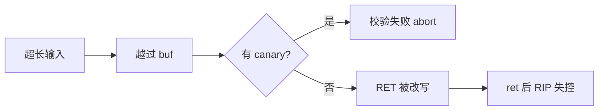
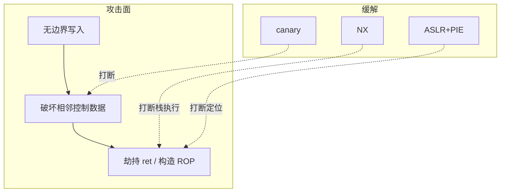

**缓冲区溢出 (buffer overflow)** 指向定长缓冲写入超过其容量的数据, 从而破坏相邻内存. 在栈上, 这常意味着覆盖保存的返回地址, 进而劫持控制流. 本文以 Phrack 49 的经典论文 *Smashing The Stack For Fun And Profit* 为线索, 结合本仓库 [`sec/bufoverflow`](https://github.com/virtualguard101/vglab/tree/main/sec/bufoverflow) 在现代 64 位 Linux 上的教学实验, 把「布局 → 崩溃 → 劫持 → ROP → 防护」串成一条可动手验证的链路.

!!! abstract "一句话地图"
    - **是什么**: 无边界检查的写入越过局部数组, 砸坏栈上的控制数据 (尤其是返回地址 RET).
    - **为何重要**: 它把「数据错误」升级为「控制流错误」, 是理解现代缓解 (canary / NX / ASLR / PIE) 的最佳入口.
    - **怎么学**: 先看清栈帧, 再对照有无 canary 的两种结局, 最后理解为何今天用 **ROP (Return-Oriented Programming)** 代替栈上 shellcode.

<!-- more -->

## 进程内存与栈帧

进程地址空间可粗分为 Text (代码, 通常只读), Data (全局 / 静态), Stack (函数调用). 栈用于传参, 保存返回地址, 分配局部变量. x86 系上栈向**低地址**生长: 新压入的内容更靠近栈顶.

一次调用后, 典型帧 (示意) 从低到高大致为:

```text
低地址  buffer ... | canary? | SFP | RET | 参数 ...  高地址
                     ↑ 现代编译器可能插入
```

仓库中的 `01_stack_layout.c` 会打印各槽相对 `rbp` 的偏移. 注意: `buffer1` / `buffer2` 谁在上由编译器决定, **偏移要以当次反汇编为准**.

<iframe src="/blog/posts/缓冲区溢出/bof-stack-frame.html"
        title="栈帧布局交互演示"
        style="width:100%;height:720px;border:0;">
</iframe>

!!! tip "和论文的对应"
    论文 example1.c 用 `gcc -S` 观察 `push` 参数与 `call` 压 RET. 本实验用运行时打印代替手工读汇编, 目标相同: 先建立「地图」, 再谈改写.

## 溢出如何劫持控制流

经典根因是无长度限制的拷贝, 例如裸 `strcpy`. 超长输入从缓冲低地址向高地址推进, 依次污染 canary (若有), SFP, RET. 函数执行 `ret` 时, CPU 按被改写的地址取指 —— 轻则段错误, 重则跳到攻击者选定位置.

### 有 canary: 先被拦住

`-fstack-protector-strong` 在缓冲与返回地址之间插入随机 canary. 覆盖 RET 前几乎必然踩坏它; 函数返回前校验失败则 `__stack_chk_fail` → abort (常见 exit=134). 对照实验: `02_overflow_canary.c`.

### 无 canary: RET 被改写

`-fno-stack-protector` 时, 同一类溢出可把 RET 写成 `0x41414141...` (`'A'`). 64 位上全 `0x41` 往往是非规范地址, 可能在 `ret` 指令上就缺页; 若改成规范地址如 `0x41414141`, 会先跳转再缺页 —— 更接近论文 32 位时代的观感 (`just gdb-03-canonical`).

<iframe src="/blog/posts/缓冲区溢出/bof-overflow.html"
        title="canary 与 RET 覆写对照演示"
        style="width:100%;height:760px;border:0;">
</iframe>



## 从 shellcode 到 ROP

论文后半把「可跳转」推进到「执行任意逻辑」: 把 shellcode 放进缓冲, 让 RET 指回栈上, 并用 NOP sled 提高命中率. 该策略依赖两个今天常不成立的前提:

1. **栈可执行** —— 现代默认 NX / DEP 禁止从栈取指.
2. **地址可猜** —— ASLR 使栈 / 库基址随机; 仅靠 `get_sp() - offset` 不再稳定.

因此教学实验 `05_rop_shell` 走 **ROP**: 不注入新代码, 而是把返回地址改成一串以 `ret` 结尾的现成指令片段 (gadget), 借 PLT 中的 `read` / `system` / `exit` 拼出伪调用链.

核心形状 (概念):

1. 溢出填充到 saved rip (本实验约 `0x98`, 由 `buf @ rbp-0x90` 推出).
2. 链上依次: `pop rdi/rsi/rdx` → `read@plt` 把 `"/bin/sh"` 读进固定 `.bss`.
3. 再 `pop rdi` → `system@plt` → 最后 `exit(0)` 干净收尾.

全程在 `-no-pie` 下不必猜运行时栈地址 (gadget / PLT / `.bss` 为链接期常量). 这同时说明: **单独开 ASLR 挡不住 no-pie 二进制上的 ROP**; 还需 PIE 把代码段一并随机化.

<iframe src="/blog/posts/缓冲区溢出/bof-rop.html"
        title="ROP 链交互演示"
        style="width:100%;height:820px;border:0;">
</iframe>

!!! warning "对齐坑"
    x86-64 上调用 `system` 前栈需 16 字节对齐, 否则可能在 glibc 内部 `movaps` 处 SIGSEGV. 练习时可在链中插入 / 删除裸 `ret` 观察现象 (`exploit.py` 保留了该 gadget 的解析).

## 防护矩阵

| 防护 | 拦截点 | 本仓库对照 |
|------|--------|------------|
| 栈 canary | 覆写 RET 前先毁 canary | `02` vs `03` |
| NX / DEP | 栈上代码不可执行 → 逼出 ROP | `05` 未关 NX |
| ASLR | 运行时地址随机 → 猜地址失效 | `04_aslr.c` |
| PIE | 二进制本身随机化 → 固定 gadget 消失 | `05` 故意 `-no-pie` 作反例 |
| 安全 API | 从源头限制写入长度 | 论文 example2 的根因 |

一句话: **canary 挡覆写, NX 挡执行, ASLR / PIE 挡定位** —— 任一单项都不够, 真实系统靠组合.



## 动手: sec/bufoverflow

在仓库根目录进入子工程后:

```sh
cd sec/bufoverflow
just demo       # 01–04: 布局 / canary / RET 砸碎 / ASLR
just demo-05    # 端到端 ROP: system("/bin/sh") 后 exit=0
just gdb-03     # 看 03 的崩溃现场
just gdb-05     # 单步观察 gadget 装配 rdi/rsi/rdx
```

`exploit.py` 从 `objdump -d` 按机器码字节现场解析 gadget, 不写死地址; `--gdb --record` 可把 payload 落到 `bin/` 供手动重放.

!!! note "伦理边界"
    实验目标是自写的教学沙盒 (含专用 gadget 捐献函数), 脚本只作用于本机自有进程. 技术用于理解原理与防御; 勿迁移到未授权目标. 论文本身亦面向学习.

## 参考

- Aleph One, [*Smashing The Stack For Fun And Profit*](http://phrack.org/issues/49/14.html), Phrack 49-14 (仓库内 `sec/bufoverflow/stack_smashing.pdf`)
- 本仓库实验: [`sec/bufoverflow`](https://github.com/virtualguard101/vglab/tree/main/sec/bufoverflow)
- [Computer Systems: A Programmer's Perspective (CSAPP)](https://csappbook.blogspot.com/) — 程序的机器级表示与栈帧章节
- [OWASP Top 10](https://owasp.org/www-project-top-ten/) — 应用层风险分类视角 (与原生栈溢出不同层, 可对照「内存破坏」一类问题)
