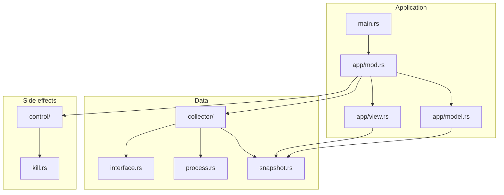

# netop 架构说明

本文描述 MVP 的模块划分、数据流、UI 模型与后续扩展路径。

## 设计目标

| 原则 | 做法 |
|------|------|
| **监控优先** | 先稳定采集与展示，控制动作隔离在 `control/` |
| **Linux 原生** | MVP 使用 `/proc` 与 `/sys`，不引入 eBPF 依赖 |
| **可演进** | Collector / Control / UI 三层解耦，便于替换数据源 |
| **htop 交互** | Ratatui + 同步主循环，500ms 默认可配置刷新 |
| **降级友好** | 无 root 时可看接口与可见进程；kill 受标准 Unix 权限约束 |

## 仓库布局

```
netop/
├── Cargo.toml
├── README.md
├── justfile
├── docs/ARCHITECTURE.md     # 本文
└── src/
    ├── main.rs              # 入口，解析 CLI
    ├── cli.rs               # clap 参数
    ├── util.rs              # 速率/字节格式化
    ├── app/
    │   ├── mod.rs           # 主循环：poll → draw → input
    │   ├── model.rs         # App 状态、排序、过滤、按键 MVU
    │   └── view.rs          # Ratatui 渲染
    ├── collector/
    │   ├── mod.rs           # Collector 聚合
    │   ├── interface.rs     # /proc/net/dev
    │   ├── process.rs       # socket inode → PID
    │   └── snapshot.rs      # 快照类型
    └── control/
        ├── mod.rs           # ControlAction 分发
        └── kill.rs          # SIGTERM via libc::kill
```

## 模块依赖图



## 运行时数据流

```mermaid
sequenceDiagram
  participant Loop as app/mod.rs
  participant Coll as Collector
  participant IF as InterfaceCollector
  participant PR as ProcessCollector
  participant UI as view.rs

  loop every interval_ms
    Loop->>Coll: poll()
    Coll->>IF: read /proc/net/dev, delta rates
    Coll->>PR: map inodes, read tcp/udp
    IF-->>Coll: Vec InterfaceStat
    PR-->>Coll: Vec ProcessStat
    Coll-->>Loop: Snapshot
    Loop->>UI: draw(app)
    Loop->>Loop: event::poll keyboard
  end
```

### 接口采集 (`collector/interface.rs`)

- **数据源**：`/proc/net/dev`
- **算法**：保存上一轮 counter，按 `elapsed` 计算 RX/TX B/s 与 PPS
- **输出**：`InterfaceStat`（含累计 errors / dropped）

### 进程采集 (`collector/process.rs`)

- **inode → PID**：扫描 `/proc/<pid>/fd/*`，解析 `socket:[inode]`
- **连接表**：解析 `/proc/net/tcp{,6}`、`/proc/net/udp{,6}`
- **聚合**：每 PID 统计 TCP 连接数、UDP socket 数、队列字节总和
- **Activity/s**：队列字节 delta / 秒（MVP 代理指标，非真实线速）

> **限制**：无 root / 无 eBPF 时无法得到 nethogs 级 per-process 带宽；Activity 仅反映 socket 缓冲区变化趋势。

## UI 模型（MVU 风格）

| 组件 | 职责 |
|------|------|
| `App` | 视图模式、排序键、过滤串、选中行、快照、确认框 |
| `handle_key` | 按键 → 更新 `App` 或返回 `Message`（Quit / Confirm） |
| `view::draw` | 只读渲染，不修改状态 |

### 视图

| 模式 | 快捷键 | 排序键（`s` 循环） |
|------|--------|-------------------|
| Interface | `1` | bandwidth → pps → name → errors |
| Process | `2` | bandwidth(activity) → connections → pid → name |

### 控制路径

```
F9 → ConfirmKind::Kill → [y] → control::execute(KillProcess)
```

拒绝向 netop 自身 PID 发送信号。

## 主循环伪代码

```rust
loop {
    if elapsed >= interval && !paused {
        app.snapshot = collector.poll()?;
    }
    terminal.draw(|f| view::draw(f, &app))?;
    if let Event::Key(k) = event::read()? {
        match handle_key(&mut app, k) { ... }
    }
}
```

MVP 使用**同步循环**（非 tokio），降低依赖与调试成本；高频事件场景可再引入 async collector 任务。

## CLI

| 选项 | 默认 | 说明 |
|------|------|------|
| `-i, --interval-ms` | 500 | 采样间隔 |
| `-p, --process-view` | false | 启动时进入进程视图 |

## MVP 范围 vs 路线图

### 已实现（MVP）

- [x] 接口 RX/TX 带宽、PPS、错误、丢包
- [x] 进程 ↔ socket 关联与连接计数
- [x] 排序、过滤、暂停刷新
- [x] SIGTERM 杀进程（确认框）
- [x] 双视图 TUI + 帮助/status 栏

### 下一阶段

| 功能 | 建议技术 |
|------|----------|
| 精确 per-process 带宽 | `aya` / `libbpf-rs` eBPF |
| 连接级视图 | INET_DIAG netlink |
| tc 限速 | `rtnetlink` / 调用 `tc` |
| 历史 / 导出 | 环形缓冲 + `serde` JSON/CSV |
| 远程监控 | gRPC / SSH 隧道 |
| macOS | `libproc` + BPF（受限） |

## 测试

单元测试覆盖：

- `/proc/net/dev` 解析
- 速率 delta 计算
- socket inode 路径解析
- 字节率格式化

集成测试需 Linux 环境；CI 可只跑 `cargo test` 中的纯函数用例。

## 构建

```bash
just build    # debug
just release  # optimized binary
just lint     # clippy -D warnings
```

Release 二进制路径：`target/release/netop`。
