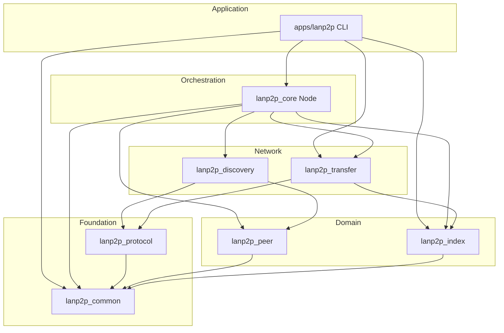

# lanp2p 架构说明

本文描述模块化重构后的目录布局、库依赖、运行时数据流与扩展方式。

## 设计目标

| 原则 | 做法 |
|------|------|
| **单一职责** | 协议编解码、发现、传输、索引、节点编排、CLI 分库 |
| **依赖倒置** | 上层只依赖下层 PUBLIC 头文件；`protocol` 不依赖 Boost |
| **稳定边界** | 领域类型在 `common`；线协议类型在 `protocol` |
| **可测试性** | 各静态库可单独链接做单元测试（后续可加 `tests/`） |
| **清晰命名空间** | `lanp2p::<module>` 与 include 路径一致 |

## 仓库布局

```
p2p/
├── CMakeLists.txt              # 工程入口
├── cmake/Lanp2pHelpers.cmake   # 编译选项、Boost 链接辅助
├── docs/ARCHITECTURE.md        # 本文
├── include/lanp2p/lanp2p.hpp   # 可选聚合头
├── libs/                       # 静态库（按依赖顺序）
│   ├── common/                 # 领域类型、配置、身份
│   ├── protocol/               # LP2P 线协议
│   ├── peer/                   # Peer 表
│   ├── index/                  # 本地文件索引
│   ├── discovery/              # UDP 发现
│   ├── transfer/               # TCP 传输
│   └── core/                   # 节点编排 (Node)
└── apps/lanp2p/                # CLI 可执行文件
    └── src/cli/                # 参数解析与命令分发
```

可执行文件输出路径：`build/apps/lanp2p/lanp2p`。

## 模块依赖图



**规则**：箭头表示链接时依赖；禁止反向依赖（例如 `protocol` 不得 include `transfer`）。

## 各模块职责

### `lanp2p_common`

- **头文件**：`lanp2p/common/types.hpp`、`config.hpp`、`defaults.hpp`、`identity.hpp`
- **内容**：`FileEntry`、`PeerInfo`、`DownloadProgress`、`AppConfig`、默认端口/定时常量、`default_node_id()`
- **依赖**：仅标准库

### `lanp2p_protocol`

- **头文件**：`lanp2p/protocol/message.hpp`、`codec.hpp`
- **内容**：`MsgType`、帧头（14 字节）、`encode_*` / `decode_*`
- **依赖**：`lanp2p_common`（`FileEntry` 用于文件列表消息）

### `lanp2p_peer`

- **头文件**：`lanp2p/peer/registry.hpp`
- **内容**：线程安全的 Peer 表，TTL 过期
- **依赖**：`lanp2p_common`

### `lanp2p_index`

- **头文件**：`lanp2p/index/file_index.hpp`
- **内容**：共享目录扫描、`..` 路径防护、`resolve()`
- **依赖**：`lanp2p_common`

### `lanp2p_discovery`

- **头文件**：`lanp2p/discovery/service.hpp`
- **内容**：UDP 广播/单播 `HELLO` / `HELLO_ACK`，更新 `peer::Registry`
- **依赖**：`protocol`、`peer`、Boost.Asio

### `lanp2p_transfer`

| 组件 | 文件 | 职责 |
|------|------|------|
| `TcpChannel` | `transfer/tcp_channel.hpp` | 帧读写、连接辅助 |
| `Server` | `transfer/server.hpp` | 接受 TCP，处理 LIST / 下载 |
| Client API | `transfer/client.hpp` | `list_remote_files`、`download_file` |

- **依赖**：`protocol`、`index`、`common`、Boost.Asio

### `lanp2p_core`

- **头文件**：`lanp2p/core/node.hpp`
- **内容**：`Node` 类（原 monolithic `App`）：统一 `io_context`、启动发现/传输、定时刷新索引与 Peer TTL
- **模式**：`run_daemon()` 全节点；`run_discovery_only()` 仅扫描（UDP 绑定端口 `0`）

### `apps/lanp2p`（CLI）

- **`cli/args`**：解析全局 flags 与子命令参数
- **`cli/commands`**：命令实现，调用 `core::Node` 或 `transfer::client`
- **原则**：CLI 不含业务协议逻辑，只做 I/O 与用户交互

## 运行时数据流

### 发现（UDP）

```
Node::run_daemon
  → discovery::Service::start
       → 每 3s 广播 HELLO (+ 127.0.0.1 单播)
       → 收到 HELLO → peer::Registry::upsert + 单播 HELLO_ACK
```

`scan` 命令：`Node::run_discovery_only()`，本地 UDP 使用**临时端口**，避免与 `run` 节点争抢同一端口（`SO_REUSEPORT` 下仍会抢包）。

### 列文件 / 下载（TCP）

```
CLI list/download
  → transfer::list_remote_files / download_file
       → TcpChannel + protocol 编解码
            ↔ 对端 transfer::Server::handle_session
                 ↔ index::FileIndex
```

### 维护循环

```
Node 每 5s:
  → registry.expire(30s)
  → index.refresh()
```

## 线协议摘要

| 字段 | 大小 |
|------|------|
| Magic `LP2P` | 4 |
| Version | 1 |
| MsgType | 1 |
| Body length | 4 BE |
| Sequence | 4 BE |
| Body | `length` 字节 |

消息类型见 `protocol/message.hpp` 中 `MsgType`。

## CMake 目标一览

| Target | 类型 | 说明 |
|--------|------|------|
| `lanp2p_common` | STATIC | 基础类型 |
| `lanp2p_protocol` | STATIC | 编解码 |
| `lanp2p_peer` | STATIC | Peer 表 |
| `lanp2p_index` | STATIC | 文件索引 |
| `lanp2p_discovery` | STATIC | UDP 发现 |
| `lanp2p_transfer` | STATIC | TCP 传输 |
| `lanp2p_core` | STATIC | 节点编排 |
| `lanp2p` | EXECUTABLE | CLI |

链接示例（自定义工具只列远程文件）：

```cmake
target_link_libraries(my_tool PRIVATE lanp2p_transfer lanp2p_protocol)
```

## 扩展指南

| 需求 | 建议落点 |
|------|----------|
| 新 TCP 消息 | `protocol/message.hpp` + `codec.cpp`；`transfer/server` & `client` |
| 分块校验 / 断点续传 | `transfer/client` + 扩展 `MsgType`；索引可增加块哈希 |
| 新发现机制（mDNS） | 新建 `libs/mdns/` 或实现 `discovery` 旁路接口 |
| 配置持久化 | `common/config` + 新 `libs/config`，`core::Node` 构造时加载 |
| GUI / TUI | 新 `apps/`，链接 `lanp2p_core` + `lanp2p_transfer` |

## 与 MVP 单目录版本的对应关系

| 旧路径 | 新路径 |
|--------|--------|
| `App` | `core::Node` |
| `Discovery` | `discovery::Service` |
| `TransferServer` | `transfer::Server` |
| `PeerRegistry` | `peer::Registry` |
| `FileIndex` | `index::FileIndex` |
| `main.cpp` 内联 CLI | `apps/lanp2p/src/cli/*` |

## 后续工程化（未实现）

- `tests/` + CTest（protocol  round-trip、index 路径校验）
- `cmake install` + `find_package(lanp2p)`
- `sendfile()` 零拷贝（`transfer/server` 发送路径）
- 将 `TcpChannel` 改为异步接口以支持更高并发
