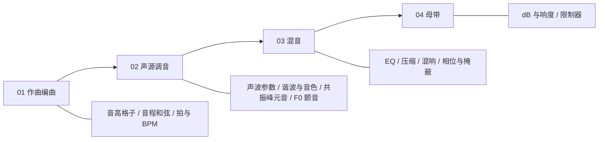
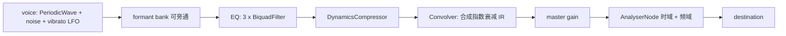

# visaudio 可视化前端

## 目标与边界

- 对应笔记: [调音混音背后的声学理论基础](docs/wiki/docs/obsidian/音视频/调音混音背后的声学理论基础.md), [乐理基础](docs/wiki/docs/obsidian/音视频/乐理基础.md)
- 成熟度: **mvp**. 浅色/深色只做深色 (manim 黑底 + 3b1b 调色: 蓝 `#58C4DD`, 黄 `#FFFF00`, 红 `#FC6255`, 绿 `#83C167`)
- 不做: 账号, 后端, 音频文件上传 (第一版全部用合成音源), 移动端适配
- 遵守 [docs/LAB.md](docs/LAB.md) 子项目契约: 独立 `justfile`, 短 README, 成熟度标签, 产物进 `dist/` (根 `.gitignore` 已含)

## 页面布局: 按产业流程



顶栏是流程条, 左侧是当前阶段的实验列表, 主区上半是 Canvas 动画, 下半是参数控件 + 一句「这个参数在 SV2 / VOCALOID / DAW 里叫什么」(来自笔记的对照表).

## 目录结构

```
misc/idea/visaudio/
├── README.md            # 是什么 / 依赖 / just 命令 / 成熟度: mvp
├── justfile             # bootstrap(pnpm install) dev build preview check(tsc)
├── package.json  tsconfig.json  vite.config.ts  index.html
├── docs/ARCHITECTURE.md # 一页: 三层结构 + 音频图
└── src/
    ├── main.ts                 # 挂载 shell, hash 路由
    ├── app/                    # shell.ts (流程条 + 侧栏), router.ts, registry.ts (实验注册表)
    ├── core/
    │   ├── audio/engine.ts     # AudioContext 单例, 用户手势后 resume, master gain, AnalyserNode
    │   ├── audio/voice.ts      # 加法合成声源: PeriodicWave 谐波 + 噪声 (气声) + LFO (颤音)
    │   ├── audio/formant.ts    # 并联 BiquadFilter(bandpass) 组, F1/F2/F3 可拖
    │   ├── dsp/filters.ts      # RBJ 双二阶 H(f) 幅频计算, 用来画 EQ 曲线 (不依赖 AnalyserNode)
    │   ├── dsp/fft.ts          # 小型 radix-2 FFT, 画静态频谱 / 卷积演示
    │   ├── dsp/theory.ts       # midi<->Hz, cents, 音程半音表, BPM->ms
    │   ├── anim/tween.ts       # 缓动 + rAF 调度, manim 式 "值过渡" 而非跳变
    │   └── viz/                # canvas.ts (DPR, 坐标轴, 网格), plots.ts (波形/频谱/曲线/脉冲响应)
    ├── ui/controls.ts          # slider / toggle / 单选 生成器, 与参数对象双向绑定
    └── stages/
        ├── 01-compose/  pitch-grid.ts  intervals.ts  tempo.ts
        ├── 02-source/   wave-params.ts harmonics.ts  formant.ts  f0-vibrato.ts
        ├── 03-mix/      eq.ts  dynamics.ts  reverb.ts  phase.ts
        └── 04-master/   loudness.ts
```

每个实验是一个模块, 导出 `{ id, stage, title, noteAnchor, mount(root): Experiment }`. `Experiment` 有 `params`, `draw(ctx, t)`, `audioGraph()`, `dispose()`. 注册表按 stage 分组生成导航, 加一个实验只需新建文件 + 注册一行.

## 音频图 (共用)



实验只启用自己关心的节点, 其余旁通. 视觉曲线尽量用 `dsp/` 里的闭式计算画 (EQ 的 `H(f)`, 谐波叠加的波形), AnalyserNode 只做「真实播放中的」叠加对照, 避免动画抖.

## 各实验要点 (与笔记章节一一对应)

- **01 作曲**: 音高格子 (钢琴键 → `440·2^((n-69)/12)`, 拖键听音, 显示 cent 偏差); 音程/和弦 (两音叠加波形 + 频谱, 同度/五度/三度/大二度对比拍频); BPM → 延迟 ms 换算
- **02 声源**: 声波参数 (A/f/φ 三滑条, 两列波叠加与 180° 抵消); 谐波 (拖 1–8 次谐波电平, 波形与频谱同屏同步, 预设 "亮/暗/方波/锯齿"); 共振峰 (F1/F2 平面上拖点, 元音三角标注 啊/衣/乌, 对应 Gender 平移); F0 颤音 (速率 5–7 Hz, 深度 cent, 量化开关, 画音高线)
- **03 混音**: EQ (bell/shelf/低切 三段, 画 `H(f)` 与 `X(f)·H(f)`, 标出笔记里的人声锚点频段); 压缩 (阈值/比例/起音, 画输入输出包络与静态曲线); 混响 (RT60 滑条生成 IR, 画 `h(t)` 与卷积后的尾巴); 相位 (延迟 0–30 ms 的梳状滤波, 单声道检查按钮)
- **04 母带**: dB 与 dBFS (振幅 ×2 = +6 dB 动画), 近似响度表 (K 加权双二阶 + 门限 RMS, 标注为近似), 限制器天花板

## 实施顺序

1. 脚手架 + shell + 调色/tween/canvas 基元 + audio engine, 先跑通「一个滑条改一个正弦并能听」
2. 02 声源四个实验 (核心价值, 验证架构)
3. 03 混音四个实验
4. 01 作曲 + 04 母带
5. README, ARCHITECTURE.md, justfile 收口; `just check` 通过 `tsc --noEmit`

## 验证

- `just dev` 每个实验可打开, 参数拖动无报错, 点击页面后能出声
- `just build` 产物在 `dist/`, `just preview` 可访问
- 与笔记数值对照: A4 = 440 Hz, +6 dB 振幅 ×2, 120 BPM 四分音符 500 ms, 180° 叠加为零

## 假设与留待你确认

- 包管理用 `pnpm` (本机已装); 不引入图表库和 UI 框架
- 部署方式先不定; `vite.config.ts` 的 `base` 留成可配, 方便日后 iframe 进 mkdocs
- 不动 wiki 文件. 完成后可作为后续建议: 在 [音频工具概述](docs/wiki/docs/obsidian/音视频/音频工具概述.md) 或声学笔记加一条链接
