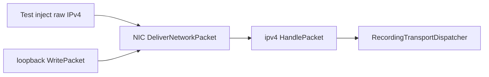

# M0：链路环回 + IPv4 解析/校验

本文档是 C++ 重写 **M0** 阶段的实施指南，对应 [`todo.md`](../todo.md) 里程碑表中的第一行。  
架构背景见 [`references/architecture.md`](../references/architecture.md)。

**总原则**：接口设计跟 Netstack（`references/`），实现深度按 smoltcp 裁剪，M0 用「喂原始帧」的单测驱动，不依赖 TUN 与完整 socket API。

---

## 定位

M0 是整条 C++ 重写的地基：**无状态头库 + 最小栈骨架 + loopback 环回**，验收标准为 **单元/集成测试能注入裸 IPv4 帧并走到预期路径**。

| 项 | 说明 |
|----|------|
| 范围 | 链路环回 + IPv4 解析/校验 |
| 验收 | 单元测试喂原始帧（无 L2 头） |
| 下一里程碑 | M1：UDP echo + `channel` link（见 [`todo.md`](../todo.md)） |

---

## 范围边界

### 应包含

| 层 | 内容 |
|----|------|
| `header` | `IPv4` 视图、`Encode` / `IsValid`、头校验和 |
| `stack`（最小） | `Stack`、`NIC`、`NetworkProtocol` 注册、`NIC::DeliverNetworkPacket` |
| `link/loopback` | 出站即入站，调用 `NetworkDispatcher::DeliverNetworkPacket` |
| `net/ipv4`（入站） | 结构校验、**校验和验证**、剥头；传输层可先不接真 UDP/TCP |
| 测试 | `std::vector<uint8_t>` 或测试用 `InjectInbound` 注入 **无 L2 的裸 IPv4** |

### 明确推迟

| 模块 | 目标阶段 |
|------|----------|
| `channel` link（完整实现） | M1 |
| 分片重组、`arp`、IP 转发、`FindRoute` 复杂逻辑 | M1+ / 扩展 |
| `waiter`、链式 `PacketBuffer`、GSO、iptables | M1+ |
| `Stack::NewEndpoint` / 完整 socket API | M1（UDP）起 |
| TUN、TCP | M2 / M3 |

### 与参考实现的差异（有意为之）

参考 `references/tcpip/network/ipv4/ipv4.go` 的 `HandlePacket` 入站路径主要调用 `IsValid`，**接收时未强制验证 IP 头校验和**。  
本教学栈在 M0 **显式验证校验和**（ones' complement 结果为 `0xffff`），并单测坏 checksum 丢弃——符合 todo 中「校验」表述，不追求与参考逐行一致。

---

## 推荐实现顺序

自下而上，避免先搭满 socket 再回头补头库：

```text
1. header/ipv4 + header/checksum     ← 纯函数，GoogleTest；可选 libFuzzer
2. netstack 基础类型                  ← Address、Error、ProtocolNumber、统计计数
3. 最小 PacketBuffer                  ← M0 用连续 buffer；ADR 说明后续再 chain
4. stack 接口骨架                     ← LinkEndpoint、NetworkDispatcher、NetworkProtocol
5. link/loopback
6. net/ipv4::Protocol::HandlePacket
7. 集成测：loopback 环回 + 注入帧
```

与 [`todo.md`](../todo.md) 中「教学实验顺序」第 1–2 步一致：以太网/IP 头库 → Stack + loopback + IPv4 本地交付路径。

---

## 与 `references/` 对照表

| C++ 目标 | 参考路径 | M0 裁剪建议 |
|----------|----------|-------------|
| IPv4 头 | `tcpip/header/ipv4.go` | `IsValid`、`CalculateChecksum`、地址解析；其余 API 可分期 |
| 校验和 | `tcpip/header/checksum.go` | 独立 target；RFC 测试向量 |
| Loopback | `tcpip/link/loopback/loopback.go` | `Attach`、`WritePacket`、`MTU=65536`；`WriteRawPacket` 可 stub |
| 网络层分发 | `tcpip/stack/nic.go`（`DeliverNetworkPacket`） | protocol 查找 → `ParseAddresses` → 本机 endpoint → `HandlePacket` |
| IPv4 入站 | `tcpip/network/ipv4/ipv4.go`（`HandlePacket`） | 仅结构校验 + 校验和 + 剥头；**不引入** `fragmentation` |
| 测试注入模式 | `tcpip/link/channel/channel.go`（`InjectInbound`） | M0 测试可直接调 `DeliverNetworkPacket`；完整 channel 留 M1 |

精读行号提示（Go 源）：

- Loopback 环回：`loopback.go` 约 77–91 行（`WritePacket` → `DeliverNetworkPacket`）
- NIC 分发：`nic.go` 约 734–784 行（`DeliverNetworkPacket`）
- IPv4 入站校验与剥头：`ipv4.go` 约 341–347 行（在其上增加 checksum 验证）

---

## 目录与 CMake target（M0）

与 [`README.md`](../README.md) 规划一致，M0 建议可独立编译的 target：

```text
netstack/
├── docs/
│   └── m0.md                 # 本文档
├── include/netstack/
├── src/
│   ├── header/               # IPv4、checksum（无状态）
│   ├── buffer/               # 最小 PacketBuffer
│   ├── stack/                # Stack、NIC、registration
│   ├── link/loopback/
│   └── net/ipv4/
└── tests/
    └── m0/                   # 头库单测 + 环回集成测
```

```text
netstack_header          # 无依赖
netstack_core            # Address, Error, stats
netstack_buffer          # 简单 Packet / PacketBuffer
netstack_stack           # Stack, NIC, registration
netstack_link_loopback
netstack_net_ipv4
tests_m0
```

构建建议：C++17、`-Wall -Wextra -Werror`；Debug 开 ASan/UBSan（见 `todo.md` C++ 节）。

---

## API 与类型设计

| 主题 | 建议 |
|------|------|
| IPv4 头 | `IPv4Header` 包装 `std::span<const uint8_t>`，不拥有内存（对标 Go `type IPv4 []byte`） |
| 地址 | `std::array<uint8_t, 4>` **或** `uint32_t` 网络序，择一写入 ADR，全项目统一 |
| 错误 | `enum class Error` + `std::expected`（C++23）或轻量 `Result<T>` |
| 可插拔协议 | 纯虚 `ILinkEndpoint` / `INetworkProtocol` + `unordered_map<ProtocolNumber, ...>` |
| 传输层（M0） | `RecordingTransportDispatcher` 等 stub，记录 `DeliverTransportPacket` 调用即可 |

相关 ADR（M0 启动时建议先写）：

- `docs/adr/001-buffer-ownership.md` — 谁分配/释放报文缓冲
- `docs/adr/002-m0-scope.md` — 一页复述本文「范围边界 + 验收」

---

## 缓冲区所有权（M0 约定）

- **测试与 loopback**：测试方持有 `std::vector<uint8_t>`，栈内仅 `std::span` 借用。
- **环回路径**：出站转 inbound 时对数据 **拷贝或移动** 一份再交付，避免别名写坏（参考 loopback 会重组 view）。
- **M0 不实现** 链式 prependable buffer；用 `vector` + `span` 便于对照 Wireshark / golden frame。

---

## 测试策略

### 1. 头库单测（不依赖 stack）

- 合法：`Encode` → `IsValid` → `CalculateChecksum()` 与 `0xffff` 关系正确
- 非法：IHL 过小、`TotalLength` > 实际长度、版本 ≠ 4、checksum 错误
- 可选：1–2 个 Wireshark 导出的 **golden frame** 回归

### 2. Stack + loopback 集成测

- `CreateNIC(1, loopback)` → `AddAddress` → 注入目的地址为本机地址的 IPv4 包
- 断言：RX 统计递增、stub `TransportDispatcher` 收到交付

### 3. 测试帧构造 helper

与参考测试一致（见 `tcpip/transport/tcp/testing/context/context.go`）：

```cpp
std::vector<uint8_t> make_ipv4_frame(
    std::array<uint8_t, 4> src,
    std::array<uint8_t, 4> dst,
    uint8_t protocol,
    std::span<const uint8_t> payload);
```

注入方式（二选一）：

- 测试直接调用 `NIC::DeliverNetworkPacket(..., IPv4ProtocolNumber, packet)`
- 或实现与 M1 `channel::InjectInbound` 同签名的测试辅助函数

**统一约定**：M0 测试帧 **无以太网头**（loopback `MaxHeaderLength() == 0`），避免同时维护 L2/L3 两套路径。

---

## 验收 checklist

- [ ] `header` 单测通过：含 `IsValid` 边界与 checksum
- [ ] `loopback`：`WritePacket` 后 `DeliverNetworkPacket` 被调用且 payload 一致
- [ ] 注入 **合法** 裸 IPv4 → `HandlePacket` 成功，payload 长度 = `TotalLength - IHL`
- [ ] 注入 **非法** 帧（含坏 checksum）→ 丢弃并递增 malformed 类统计，进程不崩溃
- [ ] stub 传输层能观察到「本机地址」包的交付（可选但推荐）
- [ ] **不要求**：UDP echo、TUN、分片、ARP、路由转发

---

## 数据路径（M0）

```text
[Test] raw IPv4 bytes
    → NIC::DeliverNetworkPacket (或 loopback WritePacket 环回)
    → ipv4::Protocol / endpoint::HandlePacket
        → IsValid + checksum verify + trim header
    → TransportDispatcher (M0: Recording stub)
```



---

## 常见坑

| 坑 | 说明 |
|----|------|
| 范围膨胀 | 把 channel、转发、分片塞进 M0，周期拉长 |
| 过早 Endpoint API | M0 只需 NIC + 网络协议分发 |
| 过早链式 buffer | 调试困难；M0 用 `vector` |
| 对齐 Linux | 单测自建向量；参考接收也不验 checksum |
| loopback 与以太网 | M0 不测 `WriteRawPacket` 以太网路径 |

---

## 第一周交付物（建议）

1. `docs/adr/001-buffer-ownership.md`、`docs/adr/002-m0-scope.md`
2. `netstack_header` + 完整 IPv4 / checksum 单测
3. `loopback` + `NIC::DeliverNetworkPacket` + `ipv4::HandlePacket`（无分片）
4. 集成测试：`inject_valid_ipv4_local_delivery`

---

## 参考资源

| 资源 | M0 用途 |
|------|---------|
| [`references/`](../references/) | 分层与接口主参考 |
| [smoltcp](https://github.com/smoltcp-rs/smoltcp) | `wire` 模块粒度参考，不 fork |
| [`todo.md`](../todo.md) | 共通原则、C++ 工程实践、后续 M1–M3 |
