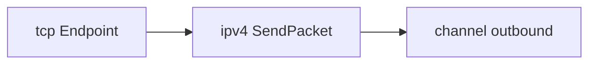

# M2：TCP 单连接（简化版）

本文档是 C++ 重写 **M2** 阶段的实施指南，对应 [`plan.md`](../plan.md) / [`todo.md`](../todo.md) 中「TCP 单连接（简化版）」里程碑。  
前置里程碑见 [`docs/m0.md`](m0.md)、[`docs/m1.md`](m1.md)；架构背景见 [`docs/refer-arch.md`](refer-arch.md)。

**总原则**：接口形状跟 Netstack（`references/`），实现深度按 smoltcp / 教学计划裁剪；**仍以 channel link 驱动集成测**，不依赖 TUN；**先跑通一条连接的三次握手 + 双向少量数据 + 挥手**，再考虑 RTO/拥塞控制。

---

## 定位

M2 在 M1 的 demuxer + IPv4 出站之上，增加 **TCP 头库、序列号算术、极简连接状态机**，验收标准为：**同一 `Stack` 上 client/server 两端（或测试注入对端段）在 channel 上完成 SYN → ACK → 数据 → FIN 关闭**。

| 项 | 说明 |
|----|------|
| 范围 | `header/tcp`、`seqnum`、被动/主动打开、`transport/tcp` 状态机（固定窗口） |
| 链路 | **`channel`** 注入/读取出站；可选 loopback 辅助 |
| 验收 | `tests/m2/tcp_handshake_test.cc`、`tests/m2/tcp_transfer_test.cc`，`ctest -R m2_tcp` |
| 下一里程碑 | M3：TUN 对接宿主（`tun_tcp_echo` 级别 demo） |

与 [`plan.md`](../plan.md) 教学顺序第 4 步一致：**TCP 极简：SYN → data → FIN（固定窗口，无 SACK）**。  
第 5 步（RTO、滑动窗口、拥塞控制）列为 **M2+ / 扩展**，不阻塞本里程碑验收。

---

## 前置条件（M1 已具备）

- `TransportDemuxer` + `Stack::DeliverTransportPacket`
- `ipv4::HandlePacket` 填写 `Route` 源/目的 IP；`net::ipv4::SendPacket` 出站
- `PortManager::Reserve` / `Bind` 模式（UDP 已验证）
- `channel::InjectInbound` + `DrainOutbound`

---

## 范围边界

### 应包含

| 层 | 内容 |
|----|------|
| `header/tcp` | `TCPHeader` 视图、`TCPFields`、`Encode`、Flags（SYN/ACK/FIN/RST）、`DataOffset`、端口解析 |
| `seqnum` | `Value` / `Size`、`LessThan`、`Add`、`InWindow`（回绕安全）；**独立单测** |
| `transport/tcp` | `Protocol`（`TransportProtocol`）、`Endpoint` 状态机 |
| 连接管理 | **单连接**：`Listen` + `Accept` **或** `Connect`（二选一先做被动打开更易测）；对端由测试注入段 |
| 握手 | 三次握手（无选项或仅固定 MSS 常量）；无 window scaling / SACK / timestamps |
| 数据传输 | 固定接收/发送窗口（如 64KiB）；按序交付；**无重传**（丢包即失败） |
| 关闭 | 四次挥手简化：FIN → ACK → FIN → ACK（或三报文合并视实现裁剪） |
| `stack` | TCP 在 demuxer 的 **四元组** 匹配（`ESTABLISHED` 后）；`Listen` 态按 `(local_ip, local_port)` |
| 测试 | channel 上脚本化对端 TCP 段；断言出站 SYN-ACK、ACK、数据、FIN |

### 明确推迟（M2+ / 扩展 / M3）

| 模块 | 目标阶段 |
|------|----------|
| RTO、重传、快速重传 | M2+（plan 第 5 步） |
| 滑动窗口动态调整、拥塞控制（Reno/CUBIC） | M2+ |
| SACK、时间戳、窗口扩大因子 | 扩展 |
| 多连接、`Listen` backlog、半连接队列 SYN flood 处理 | M2+ |
| `waiter` 完整阻塞模型 / `tcpip.Endpoint` 全 API | M2 可用 **同步 recv 队列 + 测试轮询**；完整 waiter 与 M3 一并评估 |
| TUN、`nc` 对接宿主 | M3 |
| 分片、ARP、ICMP、iptables | 扩展 |

### 与参考实现的差异

| 点 | 参考 (`references/`) | M2 教学栈 |
|----|----------------------|-----------|
| 状态机 | `endpoint.go` + `connect.go` + goroutine + 多 waker | **单线程** `enum class State` + `HandleSegment` |
| 定时器 | `sleep` / `timer.go` RTO | M2 **无** RTO；依赖测试不丢包 |
| seqnum | `tcpip/seqnum` 包 | C++ `include/netstack/seqnum.hh` 同名语义 |
| 选项 | MSS、WS、TS、SACK | M2 **无选项** 或固定 MSS=1460 常量 |
| 校验和 | 伪首部 + RX 验证 | 可先 **TX 计算 / RX 跳过**（ADR 约定） |
| 测试 | `transport/tcp/testing/context` | `tests/m2/` 自建 `MakeIpv4Tcp` 辅助 |

---

## 推荐实现顺序

自下而上，每步可单独 `ctest`：

```text
1. seqnum + 单测（回绕比较）           ← 先于 TCP 状态机
2. header/tcp + 单测                  ← Flags、DataOffset、Encode
3. transport/tcp::Protocol            ← Number、ParsePorts、MinimumPacketSize
4. Endpoint 状态枚举 + CLOSED/LISTEN    ← 仅 Listen 被动打开
5. 三次握手（SYN → SYN-ACK → ACK）      ← channel 断言出站
6. ESTABLISHED + 按序收/发单段数据      ← 固定窗口，无重传
7. FIN 关闭                            ← 连接回到 CLOSED
8. （可选）Connect 主动打开             ← 与 Listen 对称
9. tests/m2/tcp_*_test.cc              ← 集成验收
```

---

## 与 `references/` 对照表

| C++ 目标 | 参考路径 | M2 裁剪建议 |
|----------|----------|-------------|
| TCP 头 | `tcpip/header/tcp.go` | 端口、Seq/Ack、Flags、Window；**不解析选项** |
| 序列号 | `tcpip/seqnum/seqnum.go` | `LessThan`、`Add`、`InWindow`、`Overlap` |
| 传输协议 | `tcpip/transport/tcp/protocol.go` | `Number()`=6、`ParsePorts`、`MinimumPacketSize`=20 |
| 握手 | `tcpip/transport/tcp/connect.go` | 仅 `handshakeSynSent/Rcvd/Completed` 子集 |
| Endpoint | `tcpip/transport/tcp/endpoint.go` | 砍掉 cork、keepalive、SACK scoreboard |
| Demuxer TCP | `transport_demuxer.go` TCP 分支 | 单连接：Listen 表 + 已建立四元组表 |
| 测试上下文 | `transport/tcp/testing/context/context.go` | `MakeIpv4Tcp` / 注入 segment 列表 |

精读提示：

- seqnum 回绕：`seqnum.go` `LessThan` 用 `int32(v-w) < 0`
- 标志位：`header/tcp.go` `TCPFlagSyn` / `ACK` / `Fin`
- 被动打开：`accept.go` + `Listen` 路径（先看接口，实现大幅裁剪）

---

## 目录与 CMake target（M2）

```text
netstack/
├── docs/
│   ├── m2.md                          # 本文档
│   └── adr/
│       ├── 004-m2-tcp-simplified.md     # 固定窗口、无 RTO、无选项
│       └── 005-tcp-checksum.md          # 可选：RX 是否验 TCP checksum
├── include/netstack/
│   ├── header/tcp.hh
│   ├── seqnum.hh
│   └── transport/tcp/
│       ├── protocol.hh
│       ├── endpoint.hh
│       └── state.hh                   # enum class TcpState（可选独立头）
├── src/
│   ├── header/tcp.cc
│   ├── seqnum.cc                      # 若含非内联实现
│   └── transport/tcp/
│       ├── protocol.cc
│       ├── endpoint.cc
│       └── handshake.cc               # 可选：从 endpoint 拆出
└── tests/
    ├── header/tcp_test.cc
    ├── seqnum/seqnum_test.cc
    └── m2/
        ├── packet_builder.hh          # MakeIpv4Tcp、ParseTcpPayload
        ├── tcp_handshake_test.cc
        └── tcp_transfer_test.cc
```

建议 CMake：

```text
netstack_header          # + tcp.cc
netstack_seqnum          # 或并入 netstack_core
netstack_transport_tcp   # 依赖 stack + header + seqnum
tests_header_tcp
tests_seqnum
tests_m2_tcp_handshake
tests_m2_tcp_transfer
```

依赖方向：`seqnum` → `header` → `stack` → `transport/tcp`；与 UDP 相同，避免 `transport/tcp` ↔ `net` 环。

---

## API 与类型设计

### 1. `seqnum::Value` / `seqnum::Size`

对标 `tcpip/seqnum`：

```cpp
namespace netstack::seqnum {
using Value = uint32_t;
using Size = uint32_t;

bool LessThan(Value v, Value w);
Value Add(Value v, Size s);
bool InWindow(Value v, Value first, Size size);
}
```

**教学重点**：`LessThan` 必须处理 `0xFFFFFFFF` → `0` 回绕；单测覆盖。

### 2. `header::TCPHeader`

```cpp
enum class TCPFlags : uint8_t { kFin = 0x01, kSyn = 0x02, kRst = 0x04,
                                kAck = 0x10, /* ... */ };

class TCPHeader {
  // SourcePort, DestinationPort, SequenceNumber, AckNumber,
  // DataOffset (IHL*4), Flags, WindowSize, Checksum
  void Encode(const TCPFields& fields);
  static bool ParsePorts(std::span<const uint8_t> hdr, uint16_t& src, uint16_t& dst);
};
```

M2 默认 **TCP 头 20 字节**（无选项），`DataOffset == 5`。

### 3. TCP 状态（极简）

**RFC 793 Figure 6 完整对照**（Mermaid + ASCII + 转移表）见
[`docs/tcp-rfc793-states.md`](tcp-rfc793-states.md)。

```cpp
enum class TcpState {
  kClosed,
  kListen,
  kSynSent,      // M2 未实现
  kSynReceived,
  kEstablished,
  kFinWait1,     // M2 未实现
  kFinWait2,     // M2 未实现
  kCloseWait,
  kLastAck,
  kTimeWait,     // M2 跳过，直接 CLOSED
};
```

M2 验收至少经历：`Listen → SynReceived → Established → ... → Closed`。

### 4. `tcp::Endpoint`

| 方法 | M2 语义 |
|------|---------|
| `Listen(port)` | `CLOSED → LISTEN`，demuxer 登记 `(local_ip, port)` wildcard |
| `Accept()` | 返回已 `ESTABLISHED` 的子连接或阻塞至握手完成（测试可轮询） |
| `Connect(remote)` | 可选；`SynSent` → 收到 SYN-ACK → `Established` |
| `HandlePacket` | 入站 TCP 段（`pkt.Data()` 以 TCP 头开始） |
| `Write(data)` | 发送单个 PSH+ACK 段（固定窗口内） |
| `Read()` | 从 `rcv_queue_` 取字节（测试轮询） |

内部字段（示意）：

- `iss_`, `rcv_nxt_`, `snd_una_`, `snd_nxt_`（`seqnum::Value`）
- `state_`
- `rcv_buf_` / `snd_buf_`（`std::vector<uint8_t>`）

### 5. Demuxer 扩展（TCP）

M1 仅 `(net, trans, local_port, local_addr)` 精确匹配。M2 需：

| 状态 | 查找键 |
|------|--------|
| `LISTEN` | `(local_addr, local_port)`，`remote` 通配 |
| `ESTABLISHED` | 完整四元组 |

参考 `transport_demuxer.go` 对 `TCPProtocolNumber` 的 unicast 检查；M2 可拒绝非单播地址。

### 6. 出站

复用 `net::ipv4::SendPacket`：`l4_bytes` = TCP 头 + payload。  
构造 TCP 段时设置 Seq/Ack/Flags/Window；M2 窗口可常数 `65535`。

---

## 缓冲区与所有权

- 入站段：`HandlePacket` 取得 `PacketBuffer` 所有权；按 `DataOffset` 剥头后入 `rcv_queue_`。
- 出站段：新建 `vector` 组装 TCP + payload，move 进 `SendPacket`。
- 延续 [`adr/001-buffer-ownership.md`](adr/001-buffer-ownership.md)。

建议 **`docs/adr/004-m2-tcp-simplified.md`**：固定窗口、无 RTO、无 TCP 选项、TIME_WAIT 立即关闭。

---

## 测试策略

### 1. `seqnum` 单测

- `LessThan(0xFFFFFFFF, 0) == true`
- `InWindow` 边界：窗口 `[100, 100+win)` 内/外
- `Add` 回绕

### 2. `header/tcp` 单测

- `Encode` 后端口、Seq、Flags 与 `TCPFields` 一致
- `DataOffset` 小于 5 时 `IsValid` 失败

### 3. 握手集成测 `tcp_handshake_test.cc`

拓扑（被动打开）：

```text
[Test] 注入 SYN → 10.0.0.1:80
[Stack] server Listen(80) → 出站 SYN-ACK（DrainOutbound 断言）
[Test] 注入 ACK 完成握手
[Assert] server 状态 Established
```

伪代码：

```cpp
Stack s;
s.AddNetworkProtocol(std::make_unique<ipv4::Protocol>());
s.AddTransportProtocol(std::make_unique<tcp::Protocol>());
auto* ch = ... CreateNIC(NewChannel(...));
s.AddAddress(nic, {10,0,0,1});

auto server = std::make_unique<tcp::Endpoint>(&s);
server->Listen(nic, {10,0,0,1}, 80);

ch->InjectInbound(kIPv4, MakeIpv4Tcp(
    {10,0,0,2}, {10,0,0,1}, 50000, 80,
    /*tcp*/ {.flags=kSyn, .seq=1000, .ack=0}));

auto out = ch->DrainOutbound();
// 解析：SYN|ACK, seq=ISN, ack=1001

ch->InjectInbound(kIPv4, MakeIpv4Tcp(
    ..., {.flags=kAck, .seq=1001, .ack=server_isn+1}));
assert(server->State() == TcpState::kEstablished);
```

### 4. 数据传输 `tcp_transfer_test.cc`

- 建立连接后，测试注入 **一个 PSH+ACK** 数据段
- 断言 `server->Read()` 载荷一致
- `server->Write("pong")` 后 `DrainOutbound` 含数据段

### 5. 关闭

- 一方 `Close()` 发 FIN；对端 ACK；对端 FIN；ACK
- M2 可合并为测试脚本逐步注入/断言

### 6. 负向用例（建议）

| 用例 | 期望 |
|------|------|
| 非 SYN 打到 LISTEN | RST 或丢弃（文档约定其一） |
| 错误 ACK 号 | 丢弃，状态不变 |
| 乱序段（M2 无重传） | 丢弃或暂存（建议 M2 **仅按序**，乱序直接丢） |

---

## 验收 checklist

- [x] `seqnum` 单测通过（`ctest -R seqnum`）
- [x] `header/tcp` 单测通过（`ctest -R header_tcp`）
- [x] `Stack` 注册 TCP，`DeliverTransportPacket` 能到达 `tcp::Endpoint`
- [x] channel 上完成 **三次握手**（SYN / SYN-ACK / ACK 可观测）
- [x] **单段数据** 双向或单向交付正确
- [x] **FIN 关闭** 后状态回到 `CLOSED`（`tcp_transfer_test` 含 `TestFinClose`）
- [ ] **不要求**：RTO、重传、SACK、TUN、多连接、完整 `tcpip.Endpoint`

---

## 数据路径（M2）

### 入站 TCP 段

```text
[Test] InjectInbound(IPv4, bytes)
  → NIC::DeliverNetworkPacket
  → ipv4::HandlePacket（填 Route）
  → Stack::DeliverTransportPacket(proto=6)
  → TransportDemuxer（四元组 / Listen 表）
  → tcp::Endpoint::HandlePacket
  → 状态机 + rcv_queue_
```


### 出站（SYN-ACK / 数据 / FIN）



---

## 常见坑

| 坑 | 说明 |
|----|------ |
| 直接用 `uint32_t` 比较 seq | 必须用 `seqnum::LessThan` |
| 忘记 TCP 头长度 | 载荷偏移 = `DataOffset * 4`，M2 常为 20 |
| 握手与 demux 键不一致 | LISTEN 用 wildcard；ESTABLISHED 后必须四元组 |
| 一次实现重传+拥塞 | 拆 milestone；M2 固定窗口 + 无丢包测试 |
| IPv4 总长度与 TCP 段 | `TotalLength - IHL >= TCP header + payload` |
| 与 Linux 逐字段对齐 | 自建 channel 脚本，不依赖 `nc`（M3 再对接） |
| 整栈大锁 | M2 仍单线程；Endpoint 内状态变更保持可测 |

---

## 建议交付物（M2 周期）

1. `docs/adr/004-m2-tcp-simplified.md`
2. `seqnum` + `header/tcp` + 单测
3. `transport/tcp`：`Protocol` + `Endpoint`（Listen + 握手 + 单段数据 + FIN）
4. `TransportDemuxer` TCP 分支（Listen / 四元组）
5. `tests/m2/packet_builder.hh`、`tcp_handshake_test.cc`、`tcp_transfer_test.cc`
6. 更新 [`docs/module-map.md`](module-map.md)、[`todo.md`](../todo.md)

---

## 参考资源

| 资源 | M2 用途 |
|------|---------|
| [`references/tcpip/header/tcp.go`](../references/tcpip/header/tcp.go) | 头格式与标志位 |
| [`references/tcpip/seqnum/seqnum.go`](../references/tcpip/seqnum/seqnum.go) | 序列号算术 |
| [`references/tcpip/transport/tcp/connect.go`](../references/tcpip/transport/tcp/connect.go) | 握手状态 |
| [`references/tcpip/transport/tcp/testing/context/`](../references/tcpip/transport/tcp/testing/context/) | 测试造包 |
| [RFC 793](https://www.rfc-editor.org/rfc/rfc793) | TCP 状态机（教学原文） |
| [`docs/m1.md`](m1.md) | demuxer 与 channel 测试约定 |
| [`plan.md`](../plan.md) | 教学顺序第 4–5 步分界 |
| [smoltcp TCP](https://github.com/smoltcp-rs/smoltcp) | 实现深度参考 |
