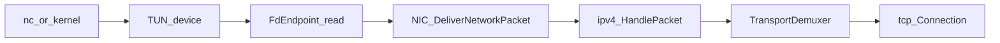
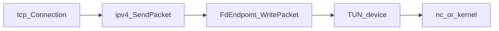

# M3：TUN 对接宿主

本文档是 C++ 重写 **M3** 阶段的实施指南，对应 [`plan.md`](../plan.md) / [`todo.md`](../todo.md) 中「TUN 对接宿主」里程碑。  
前置里程碑见 [`docs/m0.md`](m0.md)、[`docs/m1.md`](m1.md)、[`docs/m2.md`](m2.md)、[`docs/m2+.md`](m2+.md)；架构背景见 [`docs/refer-arch.md`](refer-arch.md)。

**总原则**：接口形状跟 Netstack（`references/`），实现深度按 smoltcp / 教学计划裁剪；**channel 集成测仍是 CI 主干**；M3 增加 **Linux TUN 裸 IPv4** 链路与 **`tun_tcp_echo` 级 demo**，用宿主机 `nc` 手动验收。

---

## 定位

M3 在 M2+ 的 TCP/UDP 协议栈之上，接通 **真实链路层**：从 TUN 设备 `read` 入站 IPv4 报文、经 `write` 出站，使栈与 Linux 宿主网络交互。

| 项 | 说明 |
|----|------|
| 范围 | `link/tun`、`link/fdbased`（精简）、事件循环、`examples/tun_tcp_echo` |
| 链路 | **Linux TUN（`IFF_TUN \| IFF_NO_PI`）**：裸 IPv4，与 channel `MaxHeaderLength()==0` 一致 |
| 验收 | 配置 TUN 后运行 `tun_tcp_echo`；另一终端 `nc <ip> <port>` 可 echo |
| TAP | 文档描述完整路径；**实现与验收推迟**（需 L2 以太网） |
| 下一里程碑 | RTO/重传、路由表、`SetRouteTable`、TAP、IPv6 等（扩展） |

与 [`plan.md`](../plan.md) 教学顺序第 6 步一致：**TUN demo（最后接宿主）**。  
第 5 步（RTO、滑动窗口、拥塞控制）仍不阻塞 M3 验收。

---

## 前置条件（M2+ 已具备）

- `link/channel`、`link/loopback`：`LinkEndpoint` 接口已验证
- `NIC::DeliverNetworkPacket` → `ipv4::HandlePacket` → `TransportDemuxer` → TCP/UDP
- `net::ipv4::SendPacket` → `LinkEndpoint::WritePacket` 出站
- `tcp::Listener` + `tcp::Connection`（Listen/Connect/Accept/Read/Write）
- `transport/udp::Endpoint`（Bind + echo）
- channel 上 **11 项 ctest 全绿**（`ctest -R 'm0_|m1_|m2_|header_|seqnum|stack_'`）

M3 **不替代** channel 测试；TUN 为增量能力。

---

## 范围边界

### 应包含

| 层 | 内容 |
|----|------|
| `link/tun` | 打开 `/dev/net/tun`、`ioctl(TUNSETIFF)`、`IFF_TUN\|IFF_NO_PI`、非阻塞 FD |
| `link/fdbased` | 基于 FD 的 `LinkEndpoint`：`PollOnce`/`read` → `DeliverNetworkPacket`；`WritePacket` → `write(2)` |
| 事件循环 | demo 主线程 `poll` + `read` 驱动入站；出站同步写 FD |
| `examples/tun_tcp_echo` | Stack + TUN NIC + `AddAddress` + `tcp::Listener` + per-connection echo |
| CMake | `NETSTACK_ENABLE_TUN`（默认 OFF）；`examples/tun_tcp_echo` 独立 target |
| ADR | [`docs/adr/006-m3-tun-linux.md`](adr/006-m3-tun-linux.md) |

### 明确推迟（M3+ / 扩展）

| 模块 | 目标阶段 |
|------|----------|
| **TAP**（`IFF_TAP`、以太网头、MAC） | M3+；见下文「TAP 路径」 |
| `Stack::SetRouteTable` | M3+；M3 单 NIC 直连同一 TUN |
| ARP、ICMP、IPv6 | 扩展（参考 demo 注册 ARP，TUN 裸 IP 可跳过） |
| `waiter` 完整阻塞模型 | demo 用 `poll` + 轮询 `Accept`/`Read` |
| RTO、重传、拥塞控制、完整 TCP 关闭 | M2+ 之后 |
| 分片、iptables、多 NIC | 扩展 |
| ctest 默认跑 TUN 集成测 | 手动验收；可选 `NETSTACK_TUN_INTEGRATION_TEST` |

### TUN vs TAP（文档双路径，实现先做 TUN）

| 模式 | 帧格式 | 与当前栈 | M3 |
|------|--------|----------|-----|
| **TUN** | 裸 IP（无链路头） | `MaxHeaderLength()==0`，与 channel 相同 | **实现 + 验收** |
| **TAP** | 14B 以太网 + EtherType + IP | 需 L2 demux、MAC、`WriteRawPacket` | **仅文档** |

TAP 参考 [`references/tcpip/sample/tun_tcp_echo`](references/tcpip/sample/tun_tcp_echo/main.go) 的 `-tap` 分支：打开 TAP、`EthernetHeader: true`、注册 ARP。教学栈在 TAP 就绪前不应混用 TUN 测试假设。

### 与参考实现的差异

| 点 | 参考 (`references/`) | M3 教学栈 |
|----|----------------------|-----------|
| Link | `fdbased` + `tun.Open` | 精简 `FdEndpoint` + `OpenTun` |
| Demo API | `NewEndpoint` + `waiter` | 现有 `Listener`/`Connection` + `poll` 轮询 |
| 协议 | IPv4/IPv6/ARP/TCP | IPv4 + TCP（UDP echo 可选中间步骤） |
| 路由 | `SetRouteTable` 默认路由 | 单 NIC，出站写同一 TUN |
| 平台 | Linux | **Linux only**（见 ADR 006） |

---

## 推荐实现顺序

自下而上，每步可单独验证：

```text
1. link/tun：OpenTun(name) → 非阻塞 fd（手动 / 文档验证）
2. link/fdbased：FdEndpoint 实现 LinkEndpoint（Write + PollOnce）
3. Stack 组装：CreateNIC(fd_ep) + AddAddress + 注册 ipv4/tcp[/udp]
4. 读循环：PollOnce → read → DeliverNetworkPacket(proto=0x0800)
5. examples/tun_tcp_echo：Listener + Accept + Read/Write echo
6. （可选）examples/tun_udp_echo：更简单，作中间里程碑
7. 宿主机 ip 配置 + nc 验收文档
8. （可选）tests/link/fdbased_test.cc：pipe 模拟 FD，不进默认 ctest
```

---

## 与 `references/` 对照表

| C++ 目标 | 参考路径 | M3 裁剪建议 |
|----------|----------|-------------|
| 打开 TUN | `link/tun/tun_unsafe.go` | `IFF_TUN\|IFF_NO_PI`；`SetNonblock` |
| FD endpoint | `link/fdbased/endpoint.go` | 单 FD、`read`/`write`；无 FANOUT/MMAP/recvmmsg |
| 读 MTU | `link/rawfile` | 固定 1500 或 `ioctl` |
| Demo | `sample/tun_tcp_echo/main.go` | 无 ARP/IPv6/waiter；`Listener`+`Connection` |
| TAP | 同上 `-tap` | 文档 only |

精读提示：

- TUN 必须 **NO_PI**：否则帧前多 4 字节 PI 头，IPv4 解析失败
- `fdbased.New` 的 `EthernetHeader`：TUN=false，TAP=true
- demo 主循环在参考实现中隐式由 `waiter` + `Accept` 驱动；我们用显式 `PollOnce`

---

## 目录与 CMake target（M3）

```text
netstack/
├── docs/
│   ├── m3.md                          # 本文档
│   └── adr/
│       └── 006-m3-tun-linux.md
├── include/netstack/link/
│   ├── tun.hh                           # OpenTun；OpenTap 声明 [—]
│   └── fdbased.hh                       # FdEndpoint
├── src/link/
│   ├── tun.cc
│   └── fdbased.cc
├── examples/
│   └── tun_tcp_echo.cc
└── tests/link/                          # 可选
    └── fdbased_test.cc                  # pipe 模拟，非默认 ctest
```

建议 CMake：

```text
option(NETSTACK_ENABLE_TUN "Build TUN/fdbased link and examples" OFF)

# NETSTACK_ENABLE_TUN=ON 时：
netstack_link          # + tun.cc, fdbased.cc
examples/tun_tcp_echo  # 链接 netstack_link + netstack_transport_tcp [+ udp]

# 不默认 add_test TUN；可选：
option(NETSTACK_TUN_INTEGRATION_TEST ... OFF)
```

依赖方向：`tun` → `fdbased` → `stack`；`examples` 依赖 `transport/tcp`，不反向依赖 `net`。

---

## API 与类型设计

### 1. `link::OpenTun`

```cpp
namespace netstack::link {

// 成功返回非阻塞 fd；失败返回 -1 并设置 errno
int OpenTun(std::string_view name);

// [—] M3+：IFF_TAP | IFF_NO_PI
int OpenTap(std::string_view name);

}  // namespace netstack::link
```

对标 `tun.Open`：`/dev/net/tun` + `TUNSETIFF` + `IFF_TUN|IFF_NO_PI`。

### 2. `link::FdEndpoint`

```cpp
class FdEndpoint : public stack::LinkEndpoint {
 public:
  FdEndpoint(int fd, uint32_t mtu, LinkAddress addr);

  // 从 fd 读一批入站包并 DeliverNetworkPacket（非阻塞）
  void PollOnce();

  stack::StackResult WritePacket(...) override;
  // MaxHeaderLength() == 0  （裸 IPv4）
};
```

**设计选择**：`PollOnce` 放在 `FdEndpoint` 上，**不**扩展 `Stack::PollNic`，避免 M3 改动 Stack 公共 API。

入站交付：

```cpp
// 读到 buf 后
dispatcher_->DeliverNetworkPacket(
    nic_id_, header::kIPv4ProtocolNumber, PacketBuffer(std::move(buf)));
```

### 3. `examples/tun_tcp_echo`

```text
tun_tcp_echo <tun-device> <local-ipv4> <port>
```

伪代码：

```cpp
int fd = link::OpenTun(tun_name);
auto ep = std::make_unique<link::FdEndpoint>(fd, 1500, LinkAddress{});
auto* raw = ep.get();
const auto nic_id = stack.CreateNIC(std::move(ep));
stack.AddAddress(nic_id, local_addr);

tcp::Listener listener(&stack);
listener.Listen(nic_id, local_addr, port);

for (;;) {
  raw->PollOnce();
  if (Connection* c = listener.Accept()) {
    // 每连接 echo：Read → Write，可放 connections_ 向量持有
  }
  for (auto& conn : active) {
    auto data = conn->Read();
    if (!data.empty()) conn->Write(data);
  }
}
```

### 4. 地址与路由约定（教学）

| 配置项 | 谁负责 | 说明 |
|--------|--------|------|
| 栈内「本机 IP」 | `Stack::AddAddress` | 协议栈认为该地址在本 NIC |
| TUN 接口 UP | 用户 `ip link set` | 设备需存在且 up |
| 宿主机路由/邻居 | 用户 `ip route` / `ip neigh` | 使 `nc` 发往栈地址的包进入 TUN |
| 默认路由 | M3 **不实现** `SetRouteTable` | 单 NIC 时出站一律写该 TUN |

**推荐实验拓扑**（单机）：

```text
  nc (宿主)  ──►  tun0  ──►  FdEndpoint::PollOnce  ──►  Stack
                    ▲                                    │
                    └──────── WritePacket ───────────────┘
```

栈地址与 `ip addr` **不要配成同一个 IP**。若宿主机也在 tun0 上配置了 `10.0.0.1`，本机 `nc 10.0.0.1` 会走 **local 表 → 内核 TCP**，SYN 不会进 TUN，`nc` 立即失败（exit 1）。

**推荐单机拓扑**：宿主机 `10.0.0.2`，栈内 `AddAddress` 为 `10.0.0.1`，并加 host route 把 `10.0.0.1` 指到 tun0。

---

## 数据路径（M3）

### 入站（宿主 → 栈）

```text
nc / 内核  →  write to tun fd  →  read(2)  →  FdEndpoint::PollOnce
  →  NIC::DeliverNetworkPacket(0x0800)  →  ipv4::HandlePacket
  →  TransportDemuxer  →  tcp::Listener / tcp::Connection
```



### 出站（栈 → 宿主）



与 channel 的差异：

| | channel（M0–M2+） | TUN（M3） |
|---|-------------------|-----------|
| 入站 | 测试 `InjectInbound` | OS `read` + `PollOnce` |
| 出站 | `DrainOutbound` 断言 | `write` 到 TUN，宿主可见 |

---

## 测试策略

### 1. CI（ctest）

- 保持现有 **11 项** channel/单元测试不变
- `NETSTACK_ENABLE_TUN=OFF` 为默认，CI 无需 root
- 可选：`tests/link/fdbased_test.cc` 用 **pipe** 或 socketpair 模拟 FD，验证 read/write 交付逻辑

### 2. 手动验收（M3 主验收）

```bash
# 创建 TUN（需 root 或 CAP_NET_ADMIN）
sudo ip tuntap add user "$USER" mode tun tun0
sudo ip link set tun0 up

# 宿主机与栈分地址：宿主持 10.0.0.2，栈内 AddAddress 为 10.0.0.1
sudo ip addr add 10.0.0.2/24 dev tun0
sudo ip route add 10.0.0.1/32 dev tun0

# 确认发往栈地址会进 TUN（不应出现 dev lo / local）
ip route get 10.0.0.1

# 构建（开启 TUN）
cmake -B build -DNETSTACK_ENABLE_TUN=ON
cmake --build build
./build/tun_tcp_echo tun0 10.0.0.1 8080

# 另一终端
nc -v 10.0.0.1 8080
```

期望：输入字符回显；TCP 三次握手与数据经真实 TUN 完成。

### 3. 负向用例（建议）

| 用例 | 期望 |
|------|------|
| 未 `IFF_NO_PI` | IPv4 `IsValid` 失败或乱码（文档警告，不写进 CI） |
| TUN 未 up | `read` 无数据或错误；demo 仍运行但不通 |
| 端口未 Listen | 对端 SYN 无 SYN-ACK（RST 或丢弃，与 M2 一致） |

---

## 验收 checklist

- [x] `OpenTun` 在 Linux 上打开指定设备（非阻塞）
- [x] `FdEndpoint::WritePacket` 将 IPv4 帧写入 TUN
- [x] `FdEndpoint::PollOnce` 读入帧并交付 `DeliverNetworkPacket`
- [x] `examples/tun_tcp_echo` 编译（`NETSTACK_ENABLE_TUN=ON`）
- [ ] 宿主机 `nc` 完成 TCP echo（手动）
- [x] channel/ctest **11 项仍全部通过**（TUN OFF）
- [x] **不要求**：TAP、ARP、路由表、waiter、IPv6、默认 ctest TUN

---

## 常见坑

| 坑 | 说明 |
|----|------|
| 忘记 `IFF_NO_PI` | 帧带 4 字节 PI 前缀，IPv4 头错位 |
| TUN 与 TAP 混用 | TAP 需以太网 demux；不能用 channel 裸 IP 测法 |
| 阻塞 `read` | demo 卡死；必须 `O_NONBLOCK` + `poll` |
| 用 `DrainOutbound` 验 M3 | M3 验收是 **宿主 nc**，不是 channel 队列 |
| 双配地址混淆 | **勿**在宿主机 `ip addr` 与栈 `AddAddress` 用同一 IP；本机会 local 交付 |
| `nc` 秒退、无回显 | 查 `ip route get <栈IP>`；若为 `local ... dev lo` 即未进 TUN |
| 无路由 | `nc` 发包不进 TUN；检查 `ip route get <栈IP>` |
| MTU 不一致 | 默认 1500；巨型帧可截断 |
| 单 NIC 无 `SetRouteTable` | 多 NIC 前必须实现路由（扩展） |
| CI 强依赖 TUN | 应用 CMake 开关隔离；默认 OFF |

---

## TAP 路径（文档专节，实现 `[—]`）

参考 `tun_tcp_echo -tap`：

1. `OpenTAP` → `IFF_TAP|IFF_NO_PI`
2. `fdbased` 选项 `EthernetHeader: true`
3. `MaxHeaderLength() == 14`；入站剥以太网头得 EtherType
4. 注册 **ARP**、可能需 MAC 地址
5. 出站 prepend 以太网头

M3 验收 **不依赖** TAP；实现 TAP 时另开 M3+ milestone，并增补 `header/ethernet` 与 L2 demux。

---

## 建议交付物（M3 周期）

1. [`docs/adr/006-m3-tun-linux.md`](adr/006-m3-tun-linux.md)
2. `link/tun` + `link/fdbased` + 教学注释
3. `examples/tun_tcp_echo`
4. CMake `NETSTACK_ENABLE_TUN`
5. 更新 [`docs/module-map.md`](module-map.md)、[`todo.md`](../todo.md)
6. （可选）`tests/link/fdbased_test.cc`

---

## 参考资源

| 资源 | M3 用途 |
|------|---------|
| [`references/tcpip/link/tun/tun_unsafe.go`](../references/tcpip/link/tun/tun_unsafe.go) | `Open` / `TUNSETIFF` |
| [`references/tcpip/link/fdbased/endpoint.go`](../references/tcpip/link/fdbased/endpoint.go) | FD 读写与 dispatch |
| [`references/tcpip/sample/tun_tcp_echo/`](../references/tcpip/sample/tun_tcp_echo/) | Demo 组装 |
| [`references/README.md`](../references/README.md) | 宿主机 `ip tuntap` 命令 |
| [`docs/m2+.md`](m2+.md) | TCP Listener/Connection 前置 |
| [`docs/refer-arch.md`](refer-arch.md) | link 层在架构中的位置 |
| [Linux TUN/TAP](https://www.kernel.org/doc/Documentation/networking/tuntap.txt) | `IFF_NO_PI` 语义 |
| [`plan.md`](../plan.md) | 里程碑总表 |
