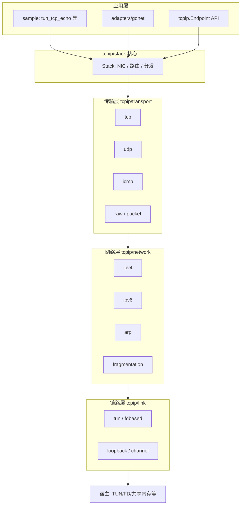

# Netstack 架构说明

本文档描述 [Google Netstack](https://github.com/google/netstack) 参考实现（位于本仓库 `references/`）的整体架构与各模块职责。该仓库已停止独立维护，主线开发在 [gVisor](https://github.com/google/gvisor) 的 `pkg/tcpip` 中继续演进。

## 项目定位

Netstack 是用 **Go 实现的用户态 TCP/IP 协议栈**，典型用途包括：

- 沙箱/容器内提供隔离网络（gVisor 沙箱网络即基于此栈）
- 通过 TUN/TAP 等接口与宿主内核或物理网络对接
- 在不依赖完整内核 socket 实现的环境中运行 TCP/UDP 应用

## 分层架构

数据自下而上经过链路层 → 网络层 → 传输层 → 应用/API 层，核心粘合点在 `tcpip/stack`。

### 典型使用流程

1. `stack.New()` 创建协议栈，注册网络层/传输层协议
2. `Stack.CreateNIC()` 绑定链路层 endpoint（如 TUN）
3. `Stack.AddAddress()`、`Stack.SetRouteTable()` 配置地址与路由
4. `Stack.NewEndpoint()` 创建 socket 端点，进行读写、连接、监听

对外类型与错误定义在根包 **`tcpip`**；栈实例与分发逻辑在 **`tcpip/stack`**。

## 目录与模块

### 顶层基础设施

| 模块 | 路径 | 作用 |
|------|------|------|
| gate | `gate/` | “用法门”同步原语：可并发进入，关闭后禁止新进入；关闭方等待已进入者全部离开。用于栈关闭、优雅停机等。 |
| waiter | `waiter/` | 等待队列：将非阻塞 I/O 转为可阻塞模式（注册可读/可写 → wait → 重试）。 |
| sleep | `sleep/` | 轻量睡眠/唤醒（含汇编优化），供定时器与调度相关逻辑使用。 |
| tmutex | `tmutex/` | 带 `TryLock` 的互斥锁，避免在不可阻塞路径上死等。 |
| ilist | `ilist/` | 侵入式链表，用于连接跟踪、端点列表等高频结构，减少堆分配。 |
| rand | `rand/` | 密码学安全伪随机数（端口、TCP ISN 等）。 |

### `tcpip/` 核心

#### `tcpip`（根包）

- 公共 API：`Address`、`NICID`、错误码、`Endpoint` 接口（Read/Write/Connect/Listen/Accept 等）

- 文档说明栈的创建、NIC/地址/路由配置及端点使用方式

#### `tcpip/stack`（协议栈核心）

- **`Stack`**：协议注册、NIC 管理、邻居解析（ARP/NDP）、路由表、报文分发表、统计、iptables 挂钩
- **`registration.go`**：定义可插拔接口
  - `NetworkProtocol` / `NetworkEndpoint`（如 IPv4/IPv6）
  - `TransportProtocol` / `TransportEndpoint`（如 TCP/UDP）
  - `LinkEndpoint`（链路层）
  - `TransportDispatcher`：网络层向传输层交付报文

#### `tcpip/link`（链路层 / L2）

实现 `stack.LinkEndpoint`，连接栈与外部世界：

| 子包 | 作用 |
|------|------|
| `tun` / `fdbased` | 基于文件描述符（TUN/TAP、seqpacket 等）收发包；官方 demo 使用此路径 |
| `loopback` | 环回 NIC，本机协议测试 |
| `channel` | 内存 channel 模拟链路，多用于单元测试 |
| `rawfile` | 底层 raw FD 读写辅助 |
| `sharedmem` | 共享内存与宿主机交换报文（高性能/虚拟化场景） |
| `muxed` | 多链路复用到单一 endpoint |
| `sniffer` | 抓包/调试包装 |
| `waitable` | 可等待的 link 包装 |

#### `tcpip/network`（网络层 / L3）

| 子包 | 作用 |
|------|------|
| `ipv4` / `ipv6` | IP 转发、本地交付、与传输层对接；须在 `stack.New` 时注册 `NewProtocol()` |
| `arp` | IPv4 地址解析 |
| `fragmentation` | IP 分片与重组 |
| `hash` | 网络层哈希表（转发表/端点查找等） |

#### `tcpip/transport`（传输层 / L4）

| 子包 | 作用 |
|------|------|
| `tcp` | TCP 状态机、拥塞控制、连接、重传、监听/accept |
| `udp` | UDP 端点 |
| `icmp` | ICMP 控制报文（与 IP 层协作） |
| `raw` | 原始套接字风格端点 |
| `packet` | 带链路头信息的 packet socket 端点 |
| `tcpconntrack` | TCP 连接跟踪（根据报文段推断连接状态），用于 NAT/防火墙类逻辑，非完整 TCP 实现 |

#### 支撑与工具包

| 模块 | 路径 | 作用 |
|------|------|------|
| header | `tcpip/header/` | 以太网/IP/TCP/UDP/ICMP/NDP 等报文头解析、构造与校验和 |
| buffer | `tcpip/buffer/` | 报文缓冲区（`View`、`Prependable` 等），减少拷贝 |
| ports | `tcpip/ports/` | 端口管理器：分配/保留/释放 ephemeral 端口 |
| seqnum | `tcpip/seqnum/` | TCP 序号算术（32 位回绕下的比较与窗口） |
| iptables | `tcpip/iptables/` | 与 Linux iptables 概念对齐的过滤/NAT 表（PREROUTING、INPUT、FORWARD 等链） |
| hash/jenkins | `tcpip/hash/jenkins/` | Jenkins 哈希，用于表查找 |
| checker | `tcpip/checker/` | 测试/调试用报文内容检查 |

#### 适配器与示例

| 模块 | 路径 | 作用 |
|------|------|------|
| gonet | `tcpip/adapters/gonet/` | 将 `tcpip.Endpoint` 包装为 `net.Conn` / `net.Listener`，兼容标准库 `net` |
| sample | `tcpip/sample/` | 示例程序：`tun_tcp_echo`（TUN + TCP echo）、`tun_tcp_connect`（TUN + TCP 连接） |

## 报文路径

### 入站（接收）

1. **link**（如 `fdbased`）从 TUN/FD 读入链路帧，交给 `Stack` 上对应 NIC
2. **network**（`ipv4`/`ipv6`）解析 IP 头，查路由；本机交付或转发；必要时经 **arp** 解析下一跳
3. **stack** 按四元组 `DeliverTransportPacket` 到 **transport**（如 `tcp`）端点
4. 应用通过 `tcpip.Endpoint.Read` 或 `gonet.Conn.Read` 取数据；若 `ErrWouldBlock` 则经 **waiter** 阻塞等待

### 出站（发送）

应用 `Write` → 传输层封装 → 网络层加 IP 头 → 链路层写出 → 宿主设备（TUN 等）。

## 插件化设计要点

各层以接口注册到 `Stack`，而非硬编码调用：

- 链路层实现 `LinkEndpoint`，经 `CreateNIC` 挂载
- 网络层实现 `NetworkProtocol`，处理 IP 与本地/转发逻辑
- 传输层实现 `TransportProtocol`，创建 `tcpip.Endpoint` 并处理入站段

这种设计便于测试（`channel`、`loopback`）与不同部署形态（TUN、sharedmem）切换。

## 与本仓库的关系

| 路径 | 说明 |
|------|------|
| `references/` | Netstack 参考源码（本文档所描述结构） |
| `architecture.md` | 本架构说明（当前文件） |

学习或实验时可对照 `references/tcpip/sample/tun_tcp_echo` 理解栈的组装方式；跟进上游实现请查阅 gVisor 仓库中的 `pkg/tcpip`。

## 延伸阅读

- [Netstack README](references/README.md)：快速上手与 TUN demo
- [gVisor](https://github.com/google/gvisor)：当前维护的主线
