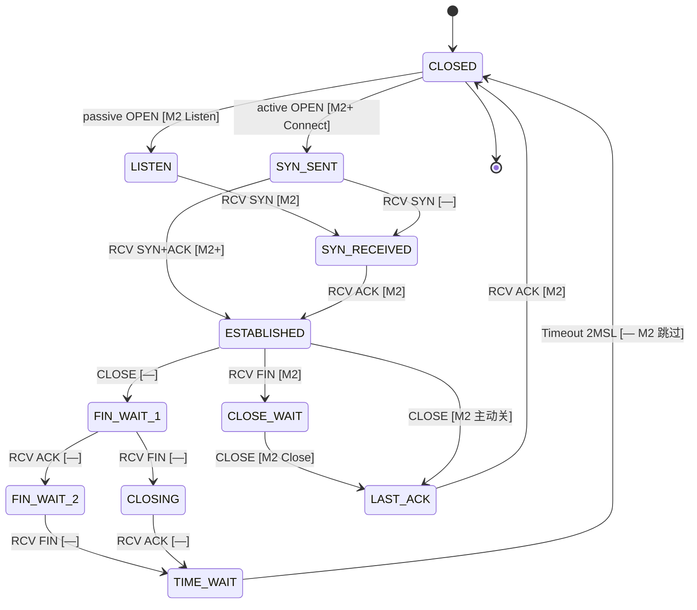

# TCP 状态图与 RFC 793 对照

本文档是教学栈中 **RFC 793 Figure 6**（TCP 连接状态图）的集中对照表。  
各模块源码通过 `@see docs/tcp-rfc793-states.md` 引用；实现细节见 `transport/tcp/endpoint.cc`。

**[M2]** = M2 基础已实现；**[M2+]** = M2 扩展已实现；**[—]** = 仍推迟。

---

## 完整状态图（Mermaid）

与 RFC 793 同构；粗体节点为 M2 `TcpState` 已实现。



---

## ASCII 简图（被动打开 + M2 关闭路径）

```text
                         RFC 793                    M2 代码
                         -------                    --------
                    ┌───────────┐
         passive    │   CLOSED   │◄────────────────────────────┐
         OPEN [M2]  └─────┬─────┘                             │
                    ┌─────▼─────┐                             │
                    │   LISTEN   │  kListen                  │
                    └─────┬─────┘                             │
              RCV SYN [M2]│                                   │
                    ┌─────▼──────────┐                          │
                    │ SYN-RECEIVED   │  kSynReceived           │
                    └─────┬──────────┘                          │
              RCV ACK [M2]│                                   │
                    ┌─────▼──────────┐                          │
         ┌──────────│  ESTABLISHED   │──────────┐               │
         │          └─────┬──────────┘          │               │
  CLOSE  │                  │ RCV FIN [M2]       │ CLOSE [M2]    │
  [—]    │          ┌───────▼────────┐           │               │
         │          │  CLOSE-WAIT    │  kCloseWait               │
         │          └───────┬────────┘           │               │
         │          CLOSE [M2]│                   │               │
         │          ┌───────▼────────┐◄──────────┘               │
         │          │   LAST-ACK     │  kLastAck                  │
         │          └───────┬────────┘                            │
         │          RCV ACK [M2]│                                │
         └─ FIN-WAIT-1 …      └────────────────────────────────┘
            [— 未实现]
```

---

## `TcpState` 与 RFC 793 状态名

| `TcpState`（C++） | RFC 793 名称 | M2 |
|-------------------|--------------|-----|
| `kClosed` | CLOSED | ✓ |
| `kListen` | LISTEN | ✓ |
| `kSynSent` | SYN-SENT | ✓ M2+ Connect |
| `kSynReceived` | SYN-RECEIVED | ✓ |
| `kEstablished` | ESTABLISHED | ✓ |
| — | FIN-WAIT-1 | ✗ |
| — | FIN-WAIT-2 | ✗ |
| `kCloseWait` | CLOSE-WAIT | ✓ |
| — | CLOSING | ✗ |
| `kLastAck` | LAST-ACK | ✓ |
| — | TIME-WAIT | ✗（M2 收到 ACK 后直接 CLOSED） |

---

## 段（Segment）与状态转移对照

| 当前状态 | 事件 / 收到段 | 发送段 | 下一状态 | M2 实现位置 |
|----------|---------------|--------|----------|-------------|
| CLOSED | `Listener::Listen()` | — | LISTEN | `listener.cc` |
| LISTEN | `SYN`（无 ACK） | `SYN\|ACK` | SYN-RECEIVED | `Listener` → `Connection` |
| CLOSED | `Connect()` | `SYN` | SYN-SENT | `connection.cc` |
| SYN-SENT | `SYN\|ACK` | `ACK` | ESTABLISHED | `Connection::HandlePacket` |
| SYN-RECEIVED | `ACK`（ack=我方 SYN+1） | — | ESTABLISHED | `Connection::HandlePacket` |
| ESTABLISHED | 按序数据 | `ACK` | ESTABLISHED | `HandlePacket` |
| ESTABLISHED | 按序 `FIN` | `ACK` | CLOSE-WAIT | `HandlePacket` |
| ESTABLISHED | `Close()` | `FIN\|ACK` | LAST-ACK | `Endpoint::Close` |
| CLOSE-WAIT | `Close()` | `FIN\|ACK` | LAST-ACK | `Endpoint::Close` |
| LAST-ACK | `ACK`（确认我方 FIN） | — | CLOSED | `HandlePacket` |

---

## 序列号在转移中的变化（RFC 793 §3.3）

| 事件 | `rcv_nxt` | `snd_nxt` | 说明 |
|------|-----------|-----------|------|
| 收到 SYN seq=S | S+1 | — | SYN 占 1 个序号 |
| 发 SYN seq=ISS | — | ISS+1 | 我方 SYN 占 ISS |
| 收到数据 len=L | +L | — | 按序交付 |
| 收到 FIN | +1 | — | FIN 占 1 个序号 |
| 发 FIN | — | +1 | 我方 FIN 占 1 个序号 |

---

## 测试覆盖的 RFC 路径

| 测试 | RFC 路径 |
|------|----------|
| `m2_tcp_handshake` | Listener：LISTEN→SYN-RECEIVED→ESTABLISHED |
| `m2_tcp_transfer` | 数据 + FIN 关闭 |
| `m2_tcp_connect` | SYN-SENT + 双向数据 |
| `m2_tcp_backlog` | backlog 满丢弃 SYN |

---

## 参考

- [RFC 793](https://www.rfc-editor.org/rfc/rfc793) — Transmission Control Protocol（Figure 6）
- [`docs/m2.md`](m2.md) — M2 里程碑范围
- [`docs/adr/004-m2-tcp-simplified.md`](adr/004-m2-tcp-simplified.md) — M2 裁剪
- [`docs/adr/005-m2-ext-demuxer-connect.md`](adr/005-m2-ext-demuxer-connect.md) — M2+ demux
- [`docs/m2+.md`](m2+.md) — M2+ 实施说明
